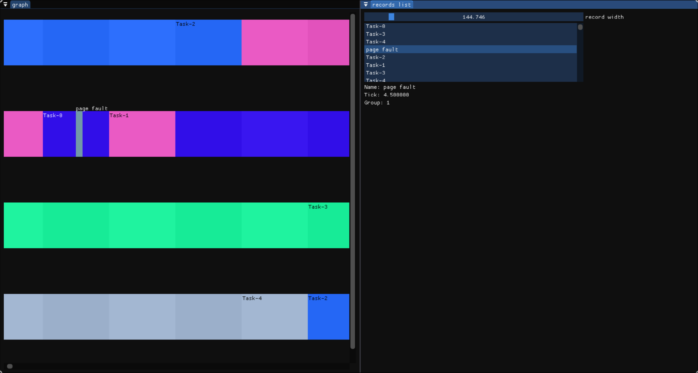

# Spinetail 

Spinetail is a tool for visualizing and analyzing event data in high-performance multiconcurrent embedded systems. 

It aims to provide a way to generate data and show it easily. To support it, you just have to write to a file in the format described in `protocol.md`.

For example in a scheduler you just have to add: 
```cpp
void emit_tick(){
    task = self.cpu_runned[cpu_id]
    print("@st:sched")
    print("#name {}", task.name)
    print("#pid {}", task.pid)
    print("#tick {}", task.start_tick)
    print("#group {}", cpu_id)
}
```

- You can also generate single tick event (like a page-fault, syscalls...). It targets operating system developpement but can be used in any context.
- You can add and look at custom attributes.

It fixes the issues of looking at raw event data splitted across multiple threads/cpus by visualizing it in a timeline.



## How to start 

```sh
$ spinetail open <path_to_log_file>
$ spinetail watch <path_to_log_file>
$ spinetail connect <tcp_ip_address>
```


## But doesn't it trash my log ?

You can use `spinetail` to visualize your log while keeping it intact by using 2 different COM port in QEMU.

## Dependencies 
- SDL3
- Imgui
